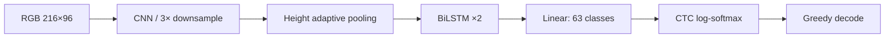

# captcha-crnn

[](LICENSE)
[](https://www.python.org/)
[](https://pytorch.org/)
[](https://github.com/SanyumCode/captcha-crnn/actions/workflows/ci.yml)

面向合规自动化、测试与研究的 PyTorch CRNN 验证码文本识别基线。项目由既有实验代码
整理而来，以 CNN 提取空间特征、BiLSTM 建模序列、CTC 在无需逐字符对齐的情况下训练。
配套服务化项目见 [captcha-service](https://github.com/SanyumCode/captcha-service)。

> 仅用于你拥有或获准测试的系统、无障碍辅助、质量保障和学术研究。不得用于绕过访问
> 控制、批量滥用第三方服务或其他违法活动。

## Features

- RGB `216×96` 输入，支持单行及上下信息融合的验证码图像
- `0-9a-zA-Z` 共 62 字符，最长标签 10，CTC greedy decoding
- checkpoint 训练/推理、TorchScript 与 ONNX 导出
- 多线程 TorchScript 批处理，以及 Python ONNX/TorchScript、Java ONNX 示例
- 路径可通过命令行或 `CAPTCHA_*` 环境变量配置；不依赖开发者本机目录
- 轻量模型结构、CTC 解码 smoke tests 与 Python 3.11 CI

## Architecture



## Repository layout

```text
.
├── src/                    # 主训练、推理、导出实现
├── examples/               # ONNX / TorchScript / Java 推理
├── legacy/minimal_crnn/    # 早期四文件最小实现
├── tests/                  # 无数据、无模型 smoke tests
├── data/sample/            # 示例数据说明（不含图片）
├── models/                 # Release 与模型元数据说明
└── .github/workflows/      # CI
```

## Quick Start

```bash
git clone https://github.com/SanyumCode/captcha-crnn.git
cd captcha-crnn
python -m venv .venv
# Windows: .venv\Scripts\activate
# Linux/macOS: source .venv/bin/activate
python -m pip install -r requirements.txt
python -m src.main --mode setup
pytest -q
```

模型文件通过 [v1.0.0 Release](https://github.com/SanyumCode/captcha-crnn/releases/tag/v1.0.0)
独立分发，避免大文件进入 Git 历史。下载后放到 `models/best_model.pth` 或
`exports/model.{pt,onnx}`；文件校验值见 [models/README.md](models/README.md)。

## Data

图片命名为 `<label>_<unique-id>.<ext>`，如 `aB19x_000042.png`。第一个下划线前是标签。
使用固定种子做 8:1:1 划分：

```bash
python -m src.data_preparation /absolute/path/raw --output data --seed 42
python -m src.main --mode validate --output-dir data
```

防止同一模板或生成批次跨集合；详细规范见 [DATASET.md](DATASET.md)。

## Train, infer and export

```bash
python -m src.train --train-dir data/train --val-dir data/val --output-dir models --epochs 100
python -m src.inference data/test/aB19x_000042.png --model models/best_model.pth
python -m src.export_model --checkpoint models/best_model.pth --torchscript exports/model.pt --onnx exports/model.onnx
python -m src.batch_inference data/test --model exports/model.pt --threads 4 --output inference_results.json
python -m examples.onnx_inference data/test/aB19x_000042.png --model exports/model.onnx
```

常用环境变量：`CAPTCHA_DATA_DIR`、`CAPTCHA_MODEL_DIR`、`CAPTCHA_DEVICE`、
`CAPTCHA_BATCH_SIZE`、`CAPTCHA_EPOCHS`。

## Reported results

以下为源项目已有记录，不是本次仓库整理过程重新跑出的结果，且评估集不同，不应横向
混为同一指标：

| 指标 | 结果 | 评估说明 |
|---|---:|---|
| Validation sequence accuracy | 89.78% | 训练过程验证集 |
| Test sequence accuracy | 3151 / 3300 = 95.48% | 独立测试记录 |
| Character accuracy | 98.36% | 字符级测试记录 |
| CPU throughput | 54 img/s | 4 线程批推理记录 |

复现这些数字需要与记录一致的数据版本和对应模型 Release；训练数据因体积与使用边界不随仓库分发。

## Roadmap

- [ ] 发布带 SHA-256 和模型卡的可复现模型 Release
- [ ] 增加 beam search、置信度与 CER 指标
- [ ] 对 ONNX 动态 batch 和 Java 示例做端到端 CI
- [ ] 提供合规许可的最小合成样例

## Citation

若本项目对研究有帮助，可引用：

```bibtex
@software{ouyang2026captchacrnn,
  author = {Ouyang Zhipeng},
  title = {captcha-crnn: A PyTorch CRNN baseline for CAPTCHA recognition},
  year = {2026},
  url = {https://github.com/SanyumCode/captcha-crnn}
}
```

## License

代码按 [MIT License](LICENSE) 发布。数据、模型和第三方依赖可能有各自许可；详见
[NOTICE](NOTICE)。安全问题参见 [SECURITY.md](SECURITY.md)。
